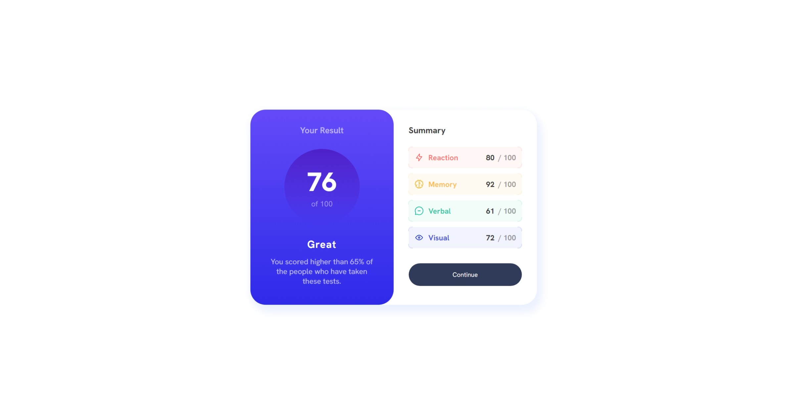
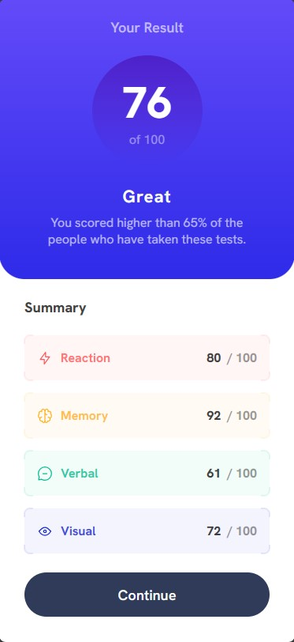

# Frontend Mentor - Results Summary Component

This is a solution to the [Results Summary Component challenge on Frontend Mentor](https://www.frontendmentor.io/challenges/results-summary-component-CE_K6s0maV).

This challenge is pretty straightforward. I could have finished in less than a week, unfortunately due to being busy with work and IRL commitments, this took quite a while longer.

Estimated: < 1 week\
Actual: 1 month

## Table of contents

- [Frontend Mentor - Results Summary Component](#frontend-mentor---results-summary-component)
  - [Table of contents](#table-of-contents)
  - [Overview](#overview)
    - [The Challenge](#the-challenge)
    - [Screenshots](#screenshots)
    - [Links](#links)
  - [My process](#my-process)
    - [Built with](#built-with)
    - [What I learned](#what-i-learned)
    - [Useful resources](#useful-resources)

## Overview

### The Challenge

Users should be able to:

- View the optimal layout for the interface depending on their device's screen size
- See hover and focus states for all interactive elements on the page
- Bonus: Use the local JSON data to dynamically populate the content

### Screenshots





### Links

- Challenge URL: [https://www.frontendmentor.io/challenges/results-summary-component-CE_K6s0maV](https://www.frontendmentor.io/challenges/results-summary-component-CE_K6s0maV)
- Solution URL: [https://github.com/ning-sy210/Results-Summary-Component](https://github.com/ning-sy210/Results-Summary-Component)
- Live Site URL: [https://ning-sy210.github.io/Results-Summary-Component/](https://ning-sy210.github.io/Results-Summary-Component/)

## My process

### Built with

- [React](https://react.dev/) (TypeScript)
- [SASS](https://sass-lang.com/documentation/)

### What I learned

The biggest takeaway from this project is dealing with responsive designs. This is the first project where I work with media queries to change how the application looks on desktop and mobile view.

This is also the first time I come across working with variable fonts, and using `@font-face` in CSS.

In SASS, there is this feature which allows for the use of loops (`@each`) in CSS. In this project, I made use of it especially in the `ScoreDisplay` component, and the below snippets are something I'm proud of.

The first instance is when I had to render different themes for the different variants. I had the base colors declared in `_abstract.scss` and using those colors, I applied different levels of alpha values to achieve the look as per the designs. I really liked this approach because it kept things really DRY, and the values for any of the properties can be tweaked very easily without hassle.

```scss
// _abstract.scss
$color--reaction-primary: hsl(0, 100%, 67%);
$color--memory-primary: hsl(39, 100%, 56%);
$color--verbal-primary: hsl(166, 100%, 37%);
$color--visual-primary: hsl(234, 85%, 45%);

// ScoreDisplay.scss
.score-display {
  // ... (details omitted for brevity)

  $variation-colors: (
    "reaction": $color--reaction-primary,
    "memory": $color--memory-primary,
    "verbal": $color--verbal-primary,
    "visual": $color--visual-primary,
  );

  @each $var, $color in $variation-colors {
    &-#{$var} {
      background-color: rgba($color, 0.05);
      color: rgba($color, 0.8);

      .corner {
        border-color: rgba($color, 0.1);
      }
    }
  }
}
```

Another instance is when I had to style those pesky corner borders for a `ScoreDisplay` component, which to be honest was something that I missed out in my initial solution because of how hard it is to notice them in the design images! Anyway for these corners, they are made up of four individual squares, each having `position: absolute`. The corner edges are then made by adding styles to the relevant edges and corner of that square. For example, the top-left corner is made by adding to the top-left square:

1.  `border-style: solid` and `border-width: $border-width` for the top and left edges, and
2.  `border-top-left-radius: $border-radius`

The below is the code that I have written to achieve this:

```tsx
// ScoreDisplay.tsx

const ScoreDisplay = ({ ... }) => {
  // other details omitted for brevity

  return (
    <div>
      // ...
      <div className={`corner top-left`}></div>
      <div className={`corner top-right`}></div>
      <div className={`corner bottom-left`}></div>
      <div className={`corner bottom-right`}></div>
    </div>
  );
};
```

```scss
// ScoreDisplay.scss

$border-length: 10px;
$border-width: 2px;
$border-offset: 1px;
$border-radius: 8px;

$x-axis-pos: "left", "right";
$y-axis-pos: "top", "bottom";

.corner {
  position: absolute;
  width: $border-length;
  height: $border-length;

  // each corner is made with a `position: absolute` square, and the corner edges are 
  // made by adding styles to the relevant edges of that square, for example:
  //   - bottom-right corner:
  //       1. add negative offset to `bottom` and `right` CSS properties
  //       2. add `border-style: solid` and `border-width` to the bottom and right edges
  //          of bottom-right square
  //       3. add `border-bottom-right-radius`
  //
  //   - top-left corner:
  //       1. add negative offset to `top` and `left` CSS properties
  //       2. add `border-style: solid` and `border-width` to the top and left edges
  //          of top-left square
  //       3. add `border-top-left-radius`
  //
  //   - and similarly for the other two corners
  @each $y in $y-axis-pos {
    @each $x in $x-axis-pos {
      &.#{$y}-#{$x} {
        border-#{$y}-#{$x}-radius: $border-radius;

        @each $pos in $x, $y {
          #{$pos}: -$border-offset;
          border-#{$pos}-width: $border-width;
          border-#{$pos}-style: solid;
        }
      }
    }
  }
}
```

Something that I thought might not be clear is, the reason why I decided to add four `position: absolute` squares to the four corners instead of just one rectangle, is because the required style of having only the corners have border widths but not the middle segments between those corners is not achievable through the latter approach. 

### Useful resources

- [Sass Docs](https://sass-lang.com/documentation/)
